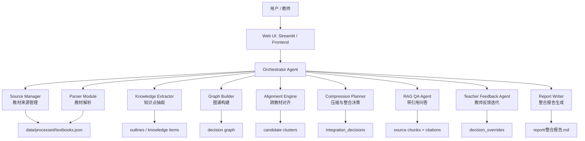

# Agent 架构说明

## 1. 设计目标

本项目的 Agent 面向“学科知识整合智能体”赛题，目标不是做一个泛聊天机器人，而是完成一条可审计的教材整合工作流：

```text
教材来源
-> 教师个性化整合需求
-> 教材解析与知识片段抽取
-> 跨教材重复/互补/缺失识别
-> 生成整合决策
-> 输出 30% 凝练版整合文档
-> 生成决策图谱
-> 教师二次反馈
-> 更新整合文档、图谱和审计记录
```

最终系统必须满足四个核心约束：

- 可复现：教材解析、整合决策、图谱和报告都有明确文件或接口。
- 可追溯：每条整合决策都保留教材名、章节、页码和原文片段。
- 可解释：每条合并、保留、删除、降级都给出理由和置信度。
- 可迭代：教师可以基于当前文档和图谱继续反馈，反馈会改变整合结果。

## 2. 总体架构

本项目采用“模块化单 Orchestrator Agent”架构。系统只有一个主编排 Agent，但内部划分为多个专业模块。这样既能体现 Agent 的规划、调用和反馈能力，又能在黑客松短时间内保证端到端闭环稳定运行。



## 3. 为什么选择模块化单 Agent

官方评分强调 Agent 架构的合理性、设计论证和调用链路，不要求堆叠多个独立 Agent。考虑比赛时间、部署复杂度和演示稳定性，本项目没有采用多进程多 Agent，而是采用单 Orchestrator + 专业模块。

### 3.1 相比复杂多 Agent 的优势

| 方案 | 优势 | 风险 | 本项目取舍 |
|---|---|---|---|
| 多 Agent 协作 | 每个 Agent 职责独立，理论上更灵活 | 调度复杂、状态同步难、调试成本高、黑客松中容易断链 | 暂不采用 |
| 单一大 Prompt Agent | 实现最快 | 难以追踪每个模块证据，输出不稳定 | 仅用于局部 LLM 决策 |
| 模块化单 Orchestrator | 调用链清晰、状态集中、易审计、易演示 | 并发和自治能力较弱 | 当前采用 |

### 3.2 设计收益

- 稳定性：教材解析、整合、图谱、问答、反馈都由同一状态流串联，减少跨服务状态丢失。
- 可审计性：每个模块都有对应数据文件、API 或报告证据。
- 可演进性：后续可以把 Extractor、RAG、Feedback 独立拆成真实多 Agent，而不改变数据结构。
- 评审友好：文档、代码目录和 UI 顺序都对应评分点，方便 AI 初筛和人工复核。

## 4. 用户工作流与 Agent 调用链

当前产品主流程被限定为以下顺序。

### 4.1 教材来源

用户先完成教材输入，二选一：

- 上传文件：PDF / TXT / Markdown / DOCX。
- 指定本地路径：例如 `E:/textbooks`。

Agent 行为：

- 检查教材来源。
- 解析为统一数据结构。
- 记录教材名、章节、页码、字符数和来源路径。
- 在 UI 中反馈已识别教材数量、章节数和解析状态。

对应证据：

- `backend/app/services/parser.py`
- `scripts/bootstrap_cached_textbooks.ps1`
- `scripts/verify_local_textbook_loop.ps1`
- `report/local_textbook_loop_check.md`
- `data/processed/textbooks.json`，本地运行生成，不提交 GitHub。

### 4.2 个性化整合需求

教材来源确定后，用户可以填写个性化要求，例如：

- “面向临床见习学生。”
- “保留感染和免疫应答的共同主干。”
- “病例降级为索引，不直接展开。”
- “抗原和免疫原不要合并。”

优先级规则：

```text
来源追溯硬约束 > 用户二次反馈 > 用户初始个性化需求 > Agent 默认整理模式
```

说明：

- 如果用户不输入需求，Agent 使用默认整理模式。
- 如果用户输入需求，用户需求优先于默认模式。
- 如果用户二次反馈，二次反馈优先于初始需求。
- 无论用户如何要求，Agent 都不能编造教材来源。

默认整理模式：

- 保留定义、分类、机制、因果关系、学习顺序和必要方法。
- 跨教材重复内容合并为共同主干。
- 互补内容保留为补充点。
- 具体案例、长说明、操作步骤和计算过程降级为索引。
- 图片、表格和机制图不参与文本去重，保留为 `visual_refs`。
- 整合正文目标控制在原始内容 30% 以内。

对应证据：

- `docs/LLM整合提示词设计.md`
- `streamlit_app.py` 中 `DEFAULT_INTEGRATION_POLICY`
- `streamlit_app.py` 中 `build_case_b_live_integration_prompt`

### 4.3 教材整合

Agent 根据教材片段和教师需求生成结构化整合决策。

整合过程中的状态反馈：

- 正在读取教材来源。
- 正在抽取章节与知识片段。
- 正在组织教师需求和默认整理策略。
- 正在生成整合决策。
- 正在更新整合文档和图谱。

LLM 调用不是直接生成一段自由文本，而是要求返回 JSON。核心字段包括：

```json
{
  "cluster_id": "string",
  "target_concept": "string",
  "decisions": [
    {
      "decision_id": "string",
      "action": "merge | keep | remove | split | downgrade_detail | keep_visual_index",
      "reason_type": "共同主干 | 互补扩展 | 案例降级 | 图表归档 | 概念误合并",
      "target_concept": "string",
      "affected_sources": [
        {
          "textbook": "string",
          "chapter": "string",
          "page": 0,
          "source_text": "string"
        }
      ],
      "integrated_text": "string",
      "reason": "string",
      "confidence": 0.0
    }
  ]
}
```

对应证据：

- `streamlit_app.py` 中 `run_case_b_live_integration`
- `streamlit_app.py` 中 `normalize_case_b_live_payload`
- `data/demo/integration_decisions_demo.json`
- `data/demo/integrated_corpus_demo.json`
- `data/demo/decision_graph_demo.json`

## 5. 模块职责

### 5.1 Source Manager

负责确定教材来源。

输入：

- 用户上传文件。
- 本地路径。
- 已解析教材缓存。

输出：

- 可解析教材列表。
- 文件名、格式、大小和解析状态。

当前实现：

- Streamlit 页面提供“指定本地路径 / 上传教材文件”入口。
- 云端部署时，如果找不到本地路径，会提示使用已解析数据或上传文件。

### 5.2 Parser Module

负责把多格式教材转成统一结构。

输入：

- PDF / TXT / Markdown / DOCX。

输出：

```json
{
  "textbook_id": "book_001",
  "title": "医学微生物学",
  "total_pages": 0,
  "total_chars": 0,
  "chapters": [
    {
      "chapter_id": "string",
      "title": "string",
      "page_start": 0,
      "page_end": 0,
      "content": "string"
    }
  ]
}
```

评分对应：

- B1 多格式文件解析。
- A1 可复现性。

### 5.3 Knowledge Extractor

负责从教材章节中抽取图谱候选项。

抽取对象：

- 概念。
- 机制。
- 分类。
- 方法。
- 现象。
- 图表引用。

输出：

- `keyword_path`
- `summary`
- `source_refs`
- `visual_refs`
- `importance_score`

评分对应：

- B2 知识点提取。
- C1 图谱可视化数据基础。

### 5.4 Graph Builder

负责生成知识图谱节点和边。

图谱分两层：

- 候选图谱：从知识点和关键词路径生成，用于展示教材结构。
- 决策图谱：从 `integration_decisions` 生成，是最终整合结果的权威图谱。

为什么最终图谱来自整合决策：

- 赛题要求每项整合必须有理由。
- 裸关键词图谱只能说明“出现过什么”，不能说明“为什么合并或降级”。
- 决策图谱可以把概念、动作、理由、来源和教师反馈连在一起。

评分对应：

- B2 图谱构建。
- B3 图谱交互。
- C1/C2 可视化。

### 5.5 Alignment Engine

负责识别跨教材重复、互补和冲突内容。

当前策略：

- 规则关键词与主题检索作为 fallback。
- LLM 对候选片段判断共同点、互补点、概念误合并和表述冲突。

后续增强：

- Embedding 相似度。
- BM25 + 向量混合检索。
- Rerank。
- 对齐阈值 benchmark。

评分对应：

- B4 跨教材整合算法。
- F 技术创新潜力。

### 5.6 Compression Planner

负责把对齐结果转成整合决策，并控制压缩比例。

决策类型：

- `merge`：合并重复或高度等价内容。
- `keep`：保留独有但重要内容。
- `remove`：从主干删除冗余内容，但保留来源索引。
- `split`：拆分被误合并的概念。
- `downgrade_detail`：把案例、说明、计算、背景降级为细节索引。
- `keep_visual_index`：保留图表索引。

评分对应：

- B4 整合决策。
- 30% 压缩要求。
- 教学完整性说明。

### 5.7 RAG QA Agent

负责基于当前整合资料和教材原文回答问题。

检索优先级：

```text
当前整合文档和整合决策
-> 教材原文 RAG chunk
-> LLM / 联网检索兜底
```

回答约束：

- 优先使用已整合资料。
- 如果整合资料不足，再查教材原文。
- 回答尽量带教材名、章节、页码和原文片段。
- 如果本地资料不足且没有 API Key，不编造答案。

评分对应：

- B5 RAG 精准问答。

### 5.8 Teacher Feedback Agent

负责处理教师二次反馈。

支持的反馈类型：

- 解释某条整合决策。
- 保留某个概念进入主干。
- 把细节降级为索引。
- 拆分误合并概念。
- 合并相关概念。
- 保留图表索引。

反馈落地方式：

- 写入 `decision_overrides`。
- 更新整合决策列表。
- 更新整合文档中的教师调整说明。
- 在决策图谱中增加教师反馈节点和高亮边。

评分对应：

- B6 多轮对话与迭代。
- D Agent 状态管理。

### 5.9 Report Writer

负责生成正式整合报告。

报告内容：

- 教材数量与字符统计。
- 压缩目标和压缩比。
- merge / keep / remove / downgrade 等决策统计。
- 典型整合案例。
- 教学完整性说明。
- 图谱和审计证据位置。

对应证据：

- `scripts/build_final_report.py`
- `report/整合报告.md`

## 6. 关键接口与数据流

### 6.1 API 映射

| 模块 | 接口 | 作用 |
|---|---|---|
| Parser | `POST /api/textbooks/parse-local` | 解析本地教材 |
| Parser | `POST /api/textbooks/upload` | 上传临时教材 |
| Outline Builder | `POST /api/outlines/build` | 构建教材层级 |
| Graph Builder | `POST /api/graph/build` | 构建图谱 |
| Integration | `POST /api/integration/run` | 执行整合压缩 |
| RAG | `POST /api/rag/query` | 带引用问答 |
| Feedback | `POST /api/feedback/chat` | 教师反馈修改 |
| Report | `GET /api/report` | 获取整合报告 |

详细定义见：

- `docs/API接口文档.md`
- `backend/app/routers/`
- `backend/app/models.py`

### 6.2 Streamlit 演示链路

当前中期演示以 Streamlit 为主入口：

```text
streamlit_app.py
```

页面主流程：

```text
1. 教材来源
2. 整合需求与二次反馈
3. 生成整合文档与图谱
4. 查看整合图谱、整合文档、正式报告
5. 查看整合依据和评审证据
6. 切换到资料问答入口
```

部署链接：

```text
https://hacson-knowledge-agent.streamlit.app
```

## 7. 状态管理与优先级

Agent 需要在同一会话内维护以下状态：

- `teacher_requirements`：教师初始个性化要求。
- `live_case_b_decisions`：真实整合调用得到的决策。
- `decision_overrides`：教师二次反馈造成的决策修改。
- `teacher_chat_history`：整合对话历史。
- `case_a_chat_history`：资料问答历史。
- `live_case_b_runs`：最近真实 LLM 返回记录。

整合优先级：

```text
来源追溯硬约束
> 教师二次反馈 decision_overrides
> 教师初始要求 teacher_requirements
> Agent 默认整合策略
> Demo fallback
```

这样可以保证：

- 教师反馈不是聊天文本，而是会写入可执行状态。
- 图谱和文档会反映反馈。
- 无 API Key 时仍可演示基本闭环。
- 有 API Key 时可进入真实 LLM 整合链路。

## 8. 与评分点的对应关系

| 评分点 | Agent 模块 | 证据位置 |
|---|---|---|
| A1 README 可复现 | Orchestrator + docs | `README.md` |
| A2 需求分析 | Orchestrator 设计输入 | `docs/需求分析.md` |
| A3 系统设计/API | 模块接口 | `docs/系统设计.md`, `docs/API接口文档.md` |
| A4 整合报告 | Report Writer | `report/整合报告.md` |
| B1 教材解析 | Parser Module | `backend/app/services/parser.py`, `report/local_textbook_loop_check.md` |
| B2 图谱构建 | Knowledge Extractor + Graph Builder | `backend/app/services/extractor.py`, `scripts/build_graph_from_outlines.ps1` |
| B3 图谱交互 | Graph Builder + UI | `streamlit_app.py`, `report/knowledge_graph_demo.html` |
| B4 跨教材整合 | Alignment + Compression | `docs/LLM整合提示词设计.md`, `data/demo/integration_decisions_demo.json` |
| B5 RAG 问答 | RAG QA Agent | `backend/app/services/rag.py`, `streamlit_app.py` |
| B6 教师反馈 | Teacher Feedback Agent | `backend/app/services/feedback.py`, `streamlit_app.py` |
| C 图谱可视化 | Graph Builder | `data/demo/decision_graph_demo.json`, `report/knowledge_graph_snapshot.svg` |
| D Agent 架构 | Orchestrator | 本文档 |
| E 工程规范 | 全部模块 | `backend/`, `frontend/`, `scripts/`, `.env.example` |

## 9. 当前边界与已知局限

中期版本已经完成可演示闭环，但仍有以下边界：

- 云端部署无法读取本机 `E:/textbooks`，需要用户上传文件或使用仓库中的小型 demo 数据。
- 完整 7 本教材的全量 LLM 分批整合尚未生产化；当前真实 LLM 链路以主题批次方式运行，避免一次性塞入 7 本书造成 token 和稳定性问题。
- RAG 目前以关键词检索和结构化片段为主，尚未加入正式向量索引、BM25 混合检索和 rerank。
- React/FastAPI 架构骨架已具备，但中期演示优先使用 Streamlit 保证公网可访问和流程稳定。
- 图谱交互可展示整合关系，但复杂多视图、热力图和拖拽修改仍是 P2/P3。

## 10. 后续优化路线

若继续冲刺 80 分以上，优先顺序如下：

1. 补充 `docs/评分点对照表.md`，让 AI 初筛能快速看到每个评分点证据。
2. 强化 README：加入公网部署链接、演示步骤和提交说明。
3. 补全 RAG 设计：说明 chunk、metadata、检索优先级和引用格式。
4. 将真实 LLM 整合结果保存到 `data/live/`，并在报告中引用。
5. 增加部署说明或 Docker 方案。
6. 后续再做向量检索、rerank、benchmark 和图谱多视图。

## 11. 总结

本项目的 Agent 不是简单调用 LLM 生成摘要，而是一个围绕教材整合任务设计的可审计 Orchestrator：

- 它先管理教材来源。
- 再接收教师个性化需求。
- 然后生成结构化整合决策。
- 基于决策输出文档和图谱。
- 最后允许教师二次反馈并更新结果。

这种设计把“教材整合”从一次性文本生成变成了可追溯、可解释、可迭代的教学内容工程流程，符合赛题对知识图谱、整合压缩、RAG 问答和 Agent 架构设计的综合要求。
