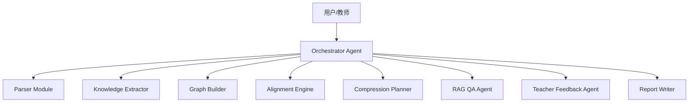

# Agent 架构说明

## 架构总览

本项目采用“模块化单 Orchestrator Agent”架构。它不是把每个能力拆成独立进程，而是在一个稳定编排器中组织多个专业模块。

## 设计理由

比赛时间只有 5 小时，复杂多 Agent 框架会增加调试和部署风险。官方评分强调“设计合理性”而不是 Agent 数量，因此我们优先选择单 Orchestrator + 专用模块：

- 稳定：接口少，端到端闭环更容易跑通。
- 清晰：每个模块职责明确，便于评分文档说明。
- 可演进：后续可将 Extractor、RAG、Feedback 拆成独立 Agent。

## 面向 AI 审计的设计

考虑到初筛可能由 AI 工具辅助完成，本项目将评分点显式映射到模块、API 与文档：

- B1 文件解析：Parser Module，`/api/textbooks/parse-local`。
- B2/B3 图谱：Knowledge Extractor + Graph Builder，`/api/graph/build`。
- B4 整合压缩：Alignment Engine + Compression Planner，`/api/integration/run`。
- B5 RAG：RAG QA Agent，`/api/rag/query`。
- B6 教师反馈：Teacher Feedback Agent，`/api/feedback/chat`。
- A/D 文档得分：README、需求分析、系统设计、Agent 架构说明、整合报告。

当前已形成的可审计证据：

- 本地教材来源：`E:/textbooks`，共 7 本医学 PDF。
- 离线解析脚本：`scripts/bootstrap_cached_textbooks.ps1`。
- 闭环验证脚本：`scripts/verify_local_textbook_loop.ps1`。
- 验证报告：`report/local_textbook_loop_check.md`，显示 7 本教材、2567 页、105 个章节/知识段、3956088 个可用字符均已入库。
- 机器可读摘要：`data/processed/parse_summary.json`，供后端或评审脚本快速检查。

## 模块职责

- Parser：教材解析、章节识别、字数统计。
- Knowledge Extractor：抽取知识点与关系。
- Graph Builder：生成前端图谱节点和边。
- Alignment Engine：识别跨教材同义知识点。
- Compression Planner：输出 merge / keep / remove 决策并控制 30% 压缩比。
- RAG QA Agent：分块、检索、生成带引用回答。
- Teacher Feedback Agent：解释整合决策，接收教师修改。
- Report Writer：输出整合报告。

## 取舍与局限

P1 阶段使用规则 fallback 和关键词检索保证演示稳定。局限是语义对齐精度不如 embedding + LLM 双重判断。P2 阶段补充向量检索、rerank 和 benchmark，用量化结果证明改进。
