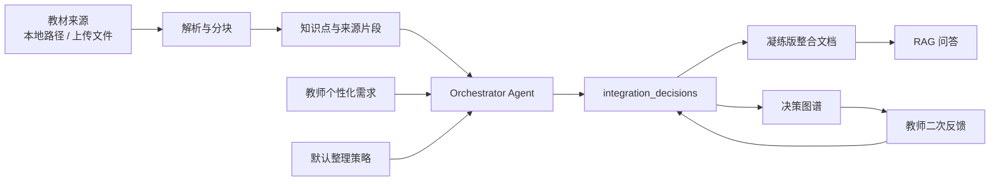

# 技术报告

## 1. 项目概述

本项目面向“学科知识整合智能体”赛题，目标是把多本医学教材中的重复、互补和细节性内容整理成一份可追溯的整合文档，并生成由整合决策驱动的知识图谱。系统强调三件事：先明确教材来源，再接收教师个性化整合需求，最后把文档、图谱、决策理由和二次反馈放在同一个闭环中。

- GitHub 仓库：[https://github.com/FangChengDong-zju/hacson_knowledge_agent_middle](https://github.com/FangChengDong-zju/hacson_knowledge_agent_middle)
- 公网部署：[https://hacson-knowledge-agent.streamlit.app](https://hacson-knowledge-agent.streamlit.app)
- 评分点对照：[docs/评分点对照表.md](评分点对照表.md)
- 闭环证据：[docs/整合闭环证据.md](整合闭环证据.md)

## 2. 用户流程

```text
上传教材文件或指定本地教材路径
-> 输入个性化整合需求，若为空则使用 Agent 默认整理模式
-> Agent 抽取教材片段并生成结构化整合决策
-> 输出 30% 凝练版整合文档和决策图谱
-> 用户基于当前文档和图谱继续反馈
-> 系统更新决策、文档、图谱和审计记录
```

优先级规则为：

```text
来源追溯硬约束 > 用户二次反馈 > 用户初始个性化需求 > Agent 默认整理模式
```

## 3. 架构设计

系统采用模块化单 Agent 结构。Orchestrator 负责把教材来源、教师需求、整合策略、LLM 调用、RAG 问答和反馈落地串联起来，底层能力由解析、抽取、图谱、整合、反馈和报告模块提供。



选择单 Orchestrator 的原因是当前中期版本需要优先保证端到端闭环稳定、审计证据清晰、演示路径短。后续可以把解析、整合、反馈和问答拆成多 Agent 协同。

## 4. 核心实现

1. 教材来源管理：支持本地路径和云端上传，上传格式包括 TXT、MD、PDF、DOCX。云端无法读取本机 `E:/textbooks`，因此公网部署提供上传入口和演示素材下载。
2. 整合决策生成：整合输出以 JSON 为核心，包括 `decision_id`、`action`、`reason_type`、`reason`、`affected_sources`、`confidence` 等字段。
3. 文档压缩：默认目标是保留共同主干、合并重复、保留互补、降级细节，整合文档目标压缩到原始材料 30% 以内。
4. 决策图谱：图谱不是直接展示裸关键词，而是由整合决策派生节点和边，节点覆盖来源教材、整合决策、核心概念、共同点、互补点和教师反馈。
5. RAG 问答：系统优先检索整合结果，再检索教材 chunk，回答中尽量保留来源。
6. 教师反馈：用户可用自然语言提出保留、拆分、合并、降级、图表索引等反馈，系统会写入 `decision_overrides` 并反映到文档和图谱。

## 5. 已完成证据

| 能力 | 当前证据 |
|---|---|
| 公网部署 | [https://hacson-knowledge-agent.streamlit.app](https://hacson-knowledge-agent.streamlit.app) |
| 项目复现 | `README.md`, `requirements.txt`, `run_streamlit_demo.ps1` |
| Agent 架构 | `docs/Agent架构说明.md` |
| 整合闭环 | `docs/整合闭环证据.md`, Streamlit “整合闭环证据总览” |
| 评分映射 | `docs/评分点对照表.md` |
| 本地教材解析 | `report/local_textbook_loop_check.md` |
| 整合报告 | `report/整合报告.md` |
| 图谱证据 | `data/demo/decision_graph_demo.json`, `report/knowledge_graph_snapshot.svg` |

## 6. 演示路线

1. 打开公网部署。
2. 在左侧选择“教材整合：生成文档与图谱”。
3. 在“教材来源”区域下载 1 分钟演示教材素材，并上传该文件。
4. 输入整合需求：`面向临床见习学生，请保留感染过程、传播链条和免疫应答的共同主干，病例和长篇背景降级为索引。`
5. 展开“整合结果：文档”“整合结果：图谱”“整合依据：决策记录”。
6. 再输入二次反馈：`请把免疫应答保留在主干，不要降级。`
7. 切换到“资料问答：基于整合结果查询”，询问感染与免疫应答的关系。

## 7. 边界与后续优化

当前版本以中期提交稳定闭环为第一目标，仍有一些明确边界：

- 云端不能读取本机教材目录，需要通过上传入口验证云端流程。
- 完整 7 本教材的全量 LLM 分批整合尚未生产化，当前用主题批次和 demo 数据证明闭环。
- RAG 当前以关键词和结构化片段检索为主，后续可接向量索引、BM25、rerank 和 benchmark。
- React/FastAPI 正式工程骨架已保留，中期公网演示优先使用 Streamlit。
- Docker、CI/CD、自动化测试和图谱高级交互是后续工程化优化方向。

## 8. 总结

本项目的主要价值不是只生成一份摘要，而是把“教材来源、教师需求、整合决策、压缩文档、图谱、反馈、问答、审计证据”连成可解释闭环。评审可以通过公网部署快速体验，也可以在 GitHub 仓库中查看每个评分点对应的证据文件。
