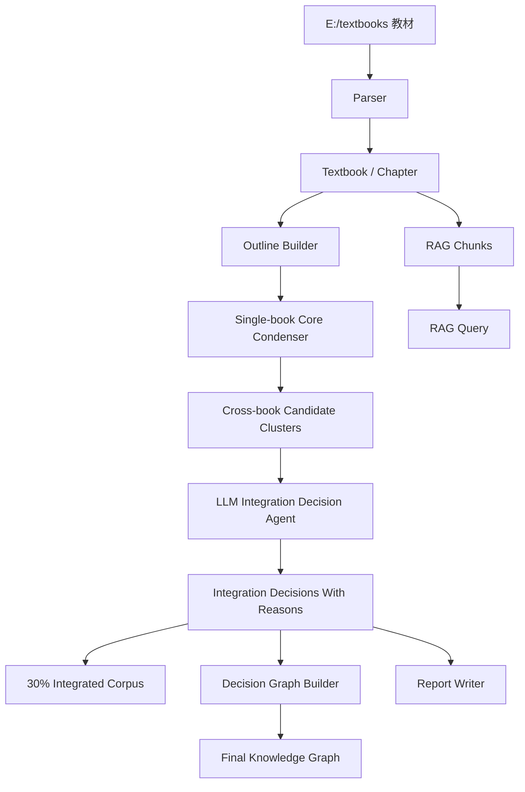

# 系统设计

## 技术选型

- 前端：React + Vite + TypeScript + Cytoscape.js。
- 后端：FastAPI + Python。
- 存储：本地 JSON，优先保证 5 小时内可演示。
- 检索：P1 使用关键词/BM25 近似，P2 接 embedding 和 rerank。
- 教材路径：通过 `TEXTBOOK_DIR=E:/textbooks` 读取，不提交 PDF。
- 解析缓存：优先使用准备阶段生成的 `textbook_chunks.jsonl`，没有缓存再解析原始 PDF。
- 评审友好：命名、文档、API 和前端区域都直接对应赛题评分点，方便 AI 审计。

## 三大块

```text
图谱（前端 1） + 问答（前端 2） + 整合索引（后端）
```

## 数据流



## 图谱编排策略

医学教材的特点是术语密集、跨教材重复出现、同一术语在不同学科语境中承担不同角色。因此图谱不直接从全文词频生成，而采用两步：

1. 教材层级整理：`Textbook -> Chapter -> Level1/Level2/Level3 Knowledge Item`，输出 `outlines.json`。
2. LLM 整合决策：对跨教材候选簇生成 `merge / keep / remove / split / downgrade_detail / keep_visual_index` 决策，每条决策必须给出理由。
3. 图谱凝练：最终图谱从 `integration_decisions.json` 生成，当前多级关键词图谱仅作为候选图谱和 demo 保底。

图谱节点分两类：
- 层级节点：如 `基础医学`、`功能调节`、`感染-免疫应答`，用于组织医学知识轴。
- 决策节点：如 `甲状腺`、`炎症`、`激素-受体调节`，由整合决策中的共同点和互补点生成。

每个最终图谱节点携带：
- `keyword_path`：如 `基础医学 > 功能调节 > 机制-过程 > 激素`。
- `textbooks`：该节点出现在哪些教材中。
- `source_refs`：可追溯原文页段。
- `visual_refs`：图/表页段索引，图片不参与文本去重，单独汇总。
- `decision_ids`：该节点来自哪些整合决策。
- `reason`：为什么合并、保留或降级。

边的来源：
- 官方/医学关系表：`prerequisite`、`contains`、`applies_to`、`parallel`。
- 多级关键词路径：上级路径到下级关键词形成 `contains`。
- 同一关键词路径：同一医学层级下的节点形成 `parallel`。
- Outline 父子关系：同一教材层级中的上下位形成 `contains`。
- 整合决策：共同点、互补点、来源教材之间形成可解释关联。

## API 一览

- GET /api/health
- GET /api/textbooks/local
- POST /api/textbooks/parse-local
- POST /api/textbooks/upload
- POST /api/outlines/build
- GET /api/outlines
- POST /api/graph/build
- GET /api/graph
- POST /api/integration/run
- GET /api/integration/decisions
- GET /api/integration/summary
- POST /api/rag/query
- POST /api/feedback/chat
- POST /api/report/generate
